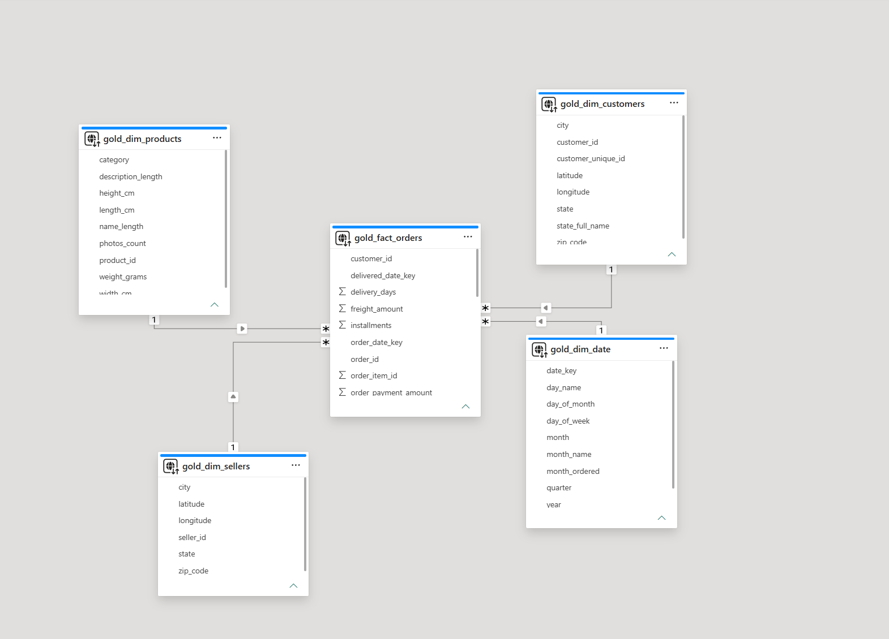
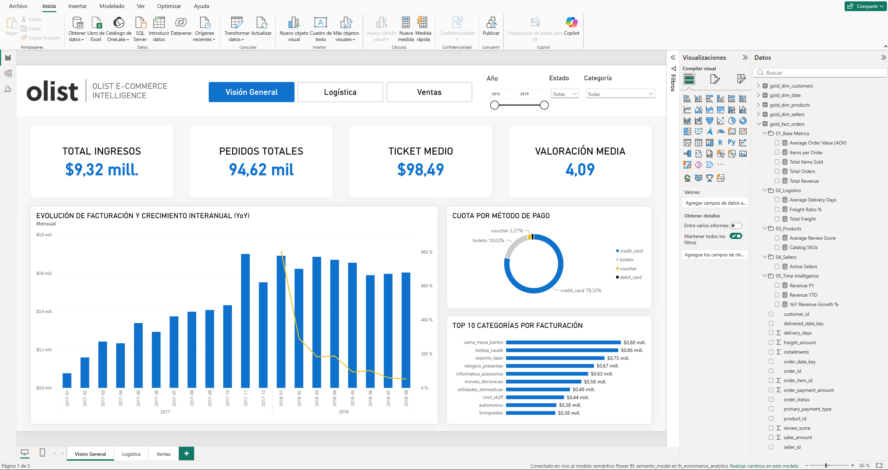
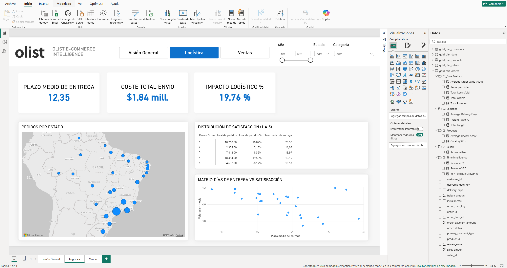
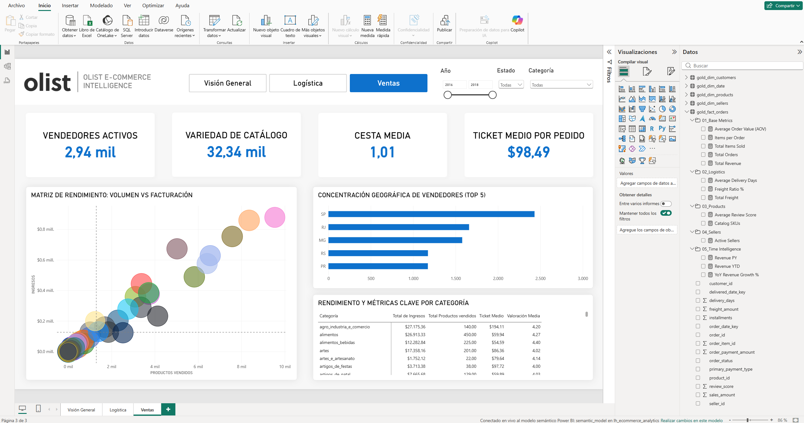

# Olist E-Commerce Intelligence Dashboard (Microsoft Fabric & Direct Lake)


## Contexto del Proyecto
Este proyecto nace de mi interés por montar un entorno analítico *end-to-end* que vaya un paso más allá del típico Power BI conectado a un Excel. Utilizando el dataset público de **Olist E-Commerce** (unos 100.000 pedidos reales en Brasil), he construido una solución de Business Intelligence orientada a tres áreas clave de negocio: toma de decisiones a nivel directivo (C-Level), rendimiento logístico y análisis del ecosistema de vendedores.

Lo interesante del proyecto es que toda la infraestructura está montada sobre **Microsoft Fabric** utilizando arquitectura Medallion. Además, en Power BI he usado el modo **Direct Lake**, lo que permite consultar directamente los archivos Delta Parquet en OneLake sin necesidad de importar ni duplicar datos, consiguiendo un rendimiento de respuesta casi instantáneo.

---


## Arquitectura y Flujo de Datos
```
[Datos Brutos Olist]
│
▼
[Lakehouse: Capa Silver] ──> Normalización, tipado y limpieza de registros
│
▼
[Lakehouse: Capa Gold]   ──> Modelo Dimensional (Star Schema)
├── Detección y limpieza de Outliers (IQR) en PySpark.
├── Filtrado de datos temporales (quitando pruebas piloto que rompían métricas).
│
▼
[Direct Lake Semantic Model] ──> Establecimiento de relaciones 1:N, Time Intelligence y organización por carpetas.
│
▼
[Power BI Report]        ──> Dashboard interactivo de 3 páginas 
```

### Decisiones de Ingeniería y Rendimiento
* **Direct Lake Mode:** Quería probar este modo en Fabric porque soluciona el eterno problema de tener que importar los datos a la memoria de Power BI. Al tirar directamente contra tablas Delta, el modelo escala de forma más eficiente.
* **Limpieza y transformación en PySpark:**
  * **Outliers:** Me di cuenta de que algunos importes de venta (`sales_amount`) tenían valores demasiado altos que destrozaban los gráficos. Lo resolví aplicando un cálculo estadístico clásico (Rango Intercuartílico) directamente en PySpark para limpiar el dataset antes de llevarlo a Power BI.
  * **Problemas con las comparativas YoY:** Los datos de 2016 eran pruebas piloto de Olist. Si los dejaba, las tasas de crecimiento interanual daban picos irreales del 10.000%. Filtré esos meses para que el negocio viese una comparativa real.
* **Organización del Modelo (DAX):** Para que el modelo semántico fuera legible, estructuré todas las medidas DAX en carpetas temáticas (`01_Base Metrics`, `02_Logistics`, `03_Products`, `04_Sellers`, `05_Time Intelligence`).

---

## Modelo de Datos (Star Schema)



* **Tabla de Hechos:** `gold_fact_orders` (granularidad a nivel de línea de producto por orden).
* **Tablas de Dimensiones:**
  * `gold_dim_date`: Calendario estándar para análisis temporales.
  * `gold_dim_customers`: Ubicación y atributos del comprador.
  * `gold_dim_products`: Catálogo y categorización de productos.
  * `gold_dim_sellers`: Red y localización geográfica de vendedores.

---

## Páginas del Informe

### 1. Visión General
Supervisión global orientada a la toma de decisiones directivas:
* **KPIs principales:** Facturación total, pedidos totales, ticket medio y satisfacción del cliente.
* **Evolución temporal:** Facturación mensual combinada con la tasa de variación interanual (`YoY %`).
* **Mix de ventas:** Distribución porcentual por método de pago y ranking de las 10 principales categorías por volumen de negocio.



---

### 2. Logística
Diagnóstico de la cadena de suministro y su impacto en la experiencia de cliente:
* **KPIs:** Plazo medio de entrega, coste total de envío e impacto logístico 
* **Análisis geoespacial:** Mapa de demanda distribuida por estados brasileños.
* **Correlación de servicio:** Matriz de dispersión relacionando plazo medio de entrega frente a la valoración media de los clientes.
* **Distribución de satisfacción**: Matriz que relaciona la valoración del cliente con el total de pedidos y el plazo medio de entrega.



---

### 3. Ventas
Evaluación del ecosistema de productos y ventas:
* **KPIs:** Vendedores activos, variedad de catálogo, cesta media, ticket medio.
* **Matriz de rendimiento:** Gráfico de cuadrantes clasificando categorías según volumen de unidades frente a ingresos generados.
* **Concentración:** En que estados se concentran los vendedores.
* **Rendimiento por categoría** Métricas clave por cada categoría de producto.



---

## Estructura del Repositorio

```text
├── README.md                  <- Documentación técnica del proyecto
├── pbip/                      <- Archivo del reporte de Power BI 
├── notebooks/                 <- Notebook de PySpark ejecutados en Microsoft Fabric
│   └──  cleaning_data.ipynb
├── dax/                       <- Scripts de medidas DAX organizadas por carpeta
│   ├── 01_base_metrics.dax
│   ├── 02_logistics.dax
│   ├── 03_products.dax
│   ├── 04_sellers.dax
│   └── 05_time_intelligence.dax
├── docs/                      <- Diagrama del modelo dimensional
│   └── star_schema_diagram.png
└── assets/                    <- Capturas del dashboard 
    ├── cover.png
    ├── page1_executive.png
    ├── page2_logistics.png
    └── page3_products.png

```
---

## Stack Tecnológico
* Microsoft Fabric: Entorno principal (OneLake, Lakehouse, tablas Delta).
* Procesamiento de datos: PySpark y Python.
* Visualización y Modelado: Power BI Desktop (Direct Lake, DAX).

## Sobre mí
**Iván Benito Sánchez**
*Data & BI Analyst*

[Linkedin](https://www.linkedin.com/in/ivanbenitosanchez/)
